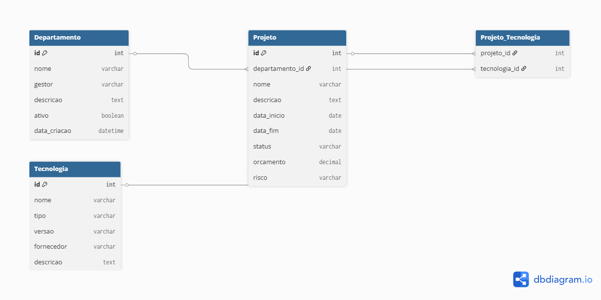

# InnovaBank - API de Gestão de Portfólio de TI

[](https://www.python.org/downloads/)
[](https://www.djangoproject.com/)
[](https://www.sqlite.org/)
[](https://python-poetry.org/)
[](https://opensource.org/licenses/MIT)

## Instituições de Fomento e Parceria
[](https://www.ifb.edu.br/) 
[](https://hardware.org.br/)

## Orientador

**Professor Henrique Freitas**

[](https://www.linkedin.com/in/claudioulisse/)
[-%23181717.svg?logo=github&logoColor=white)](https://github.com/claulis)
[](http://lattes.cnpq.br/4607303092740768)

## Sumário

- [Visão Geral](#visão-geral)
- [Pacotes Utilizados](#pacotes-utilizados)
- [Estrutura do Projeto](#estrutura-do-projeto)
- [Diagrama de Banco de Dados](#diagrama-de-banco-de-dados)
- [Documentação da API](#documentação-da-api)
- [Configuração do Ambiente](#configuração-do-ambiente)
- [Deploy](#deploy)

## Visão Geral

API desenvolvida para a **InnovaBank**, uma instituição financeira de grande porte, com o objetivo de centralizar a governança do portfólio de projetos de TI.

O sistema permite o gerenciamento de **departamentos**, **projetos** e **tecnologias** utilizadas pelo banco, oferecendo uma fonte única de dados para dashboards estratégicos e auditoria. A solução atende aos requisitos de segurança onde a leitura é pública (internamente), mas a escrita é restrita a gestores autenticados.

## Pacotes Utilizados

Abaixo, a lista dos principais pacotes utilizados no desenvolvimento.

| Pacote                  | Versão       | Descrição                                      |
|-------------------------|--------------|------------------------------------------------|
| Django                  | 5.x          | Framework web principal                        |
| djangorestframework     | 3.15.x       | Toolkit para construção de APIs REST           |
| django-filter           | latest       | Sistema de filtros avançados (datas, status)   |
| drf-yasg                | latest       | Geração automática de documentação Swagger     |

> **Nota:** O gerenciamento de dependências é feito através do **Poetry**. Consulte o arquivo `pyproject.toml` para detalhes.

## Estrutura do Projeto

Apresentação da organização dos diretórios e arquivos principais do InnovaBank.
projeto_innovabank/ ├── manage.py ├── pyproject.toml # Dependências do Poetry ├── poetry.lock # Versões travadas das dependências ├── .gitignore ├── setup/ # Configurações do Projeto │ ├── init.py │ ├── settings.py │ ├── urls.py │ └── wsgi.py ├── gestao/ # App Principal (Regras de Negócio) │ ├── migrations/ │ ├── models.py # Modelagem (Departamento, Projeto, Tecnologia) │ ├── views.py # Lógica dos Endpoints e Filtros │ ├── serializers.py # Transformação de dados │ └── urls.py # Rotas do App └── docs/ # Documentação └── diagrama_banco.png # Imagem do modelo relacional

## Diagrama de Banco de Dados



> **Descrição:** O modelo relacional gerencia Departamentos (1:N com Projetos) e Tecnologias (N:N com Projetos). A entidade Projeto centraliza as regras de negócio, incluindo controle de orçamento, riscos e prazos.

## Documentação da API

A documentação interativa está disponível em `/swagger/` (Swagger UI) no ambiente de desenvolvimento.

### Endpoints Principais

| Método | Endpoint              | Descrição                          | Autenticação |
|--------|-----------------------|------------------------------------|--------------|
| GET    | `/api/departamentos/` | Lista todos os departamentos       | Opcional     |
| GET    | `/api/projetos/`      | Lista projetos (com filtros)       | Opcional     |
| POST   | `/api/projetos/`      | Cria um novo projeto               | **Requerida**|
| GET    | `/api/tecnologias/`   | Lista tecnologias do banco         | Opcional     |

> **Detalhes:** Consulte a interface Swagger para schemas de request/response, parâmetros e exemplos.

## Configuração do Ambiente

Este projeto utiliza o **Poetry** para gerenciamento de dependências. Siga os passos abaixo:

1. **Clone o repositório:**
   ```bash
   git clone [https://github.com/SEU-USUARIO/projeto_innovabank.git](https://github.com/SEU-USUARIO/projeto_innovabank.git)
   cd projeto_innovabank

   Instale o Poetry (caso não tenha):

Bash

pip install poetry
Instale as dependências do projeto:

Bash

poetry install
Ative o ambiente virtual:

Bash

poetry shell
Prepare o Banco de Dados:

Bash

python manage.py migrate
Crie um superusuário (opcional):

Bash

python manage.py createsuperuser
Inicie o servidor:

Bash

python manage.py runserver
Acesse a documentação em: http://127.0.0.1:8000/swagger/

Deploy (opcional)
Plataforma Recomendada: [Render / Railway / AWS]
Prepare o Procfile:

web: gunicorn setup.wsgi:application --log-file -
Configure variáveis de ambiente na plataforma de deploy (SECRET_KEY, DEBUG=False).

Execute migrações em produção:

Bash

python manage.py migrate
Colete arquivos estáticos (se aplicável):

Bash

python manage.py collectstatic

